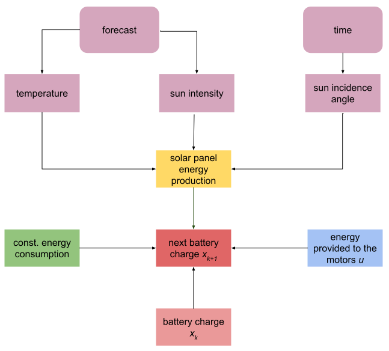

# Energy Optimization

Modeling the energy budget of a solar-powered boat and planning the motor actuation to maximize the distance traveled.

## Classification of the system:

- discrete time system
- discretized (finite) state space
- discretized control set
- time variant
- non-linear

## Dynamic Programming approach:

  

## Model:

  

